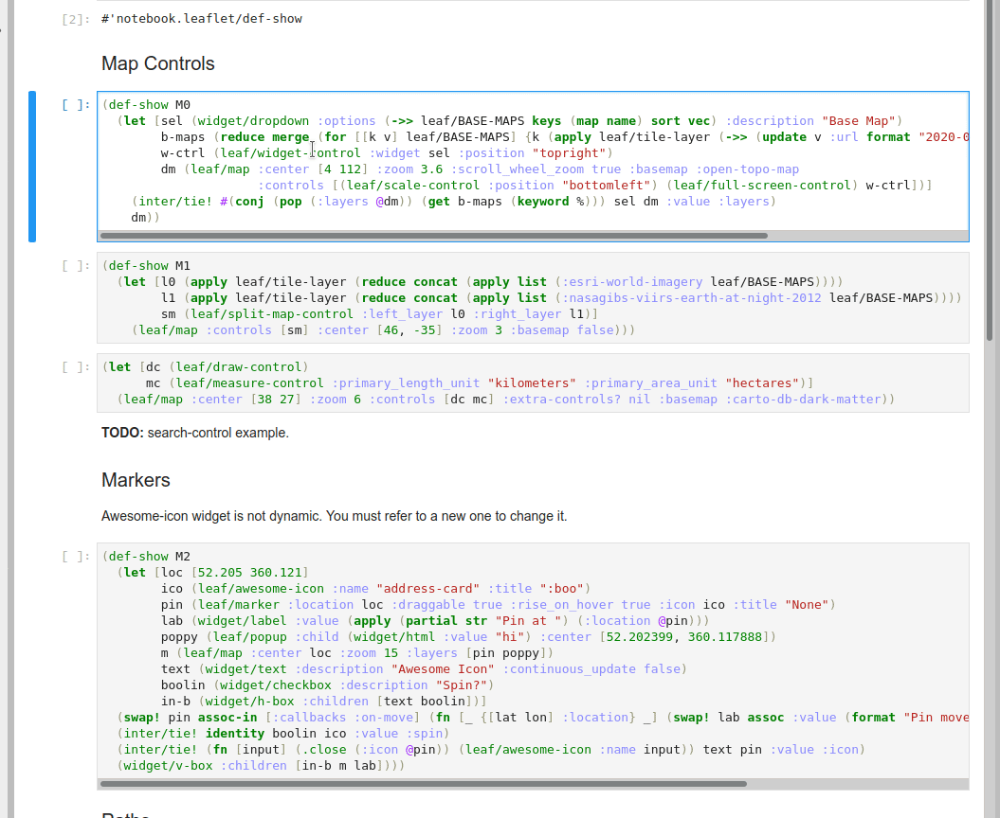

# leaflet
Interactive maps for clojupyter.

## Usage
```clojure
(require '[clojupyter-plugin.leaflet :as leaf])
(leaf/map :zoom 3 :center [-14 -75])
```
The main widget of the package is `leaflet/map`. It includes other widgets that can't be displayed by themselves, such as map controls and layers.

### Base Maps
The style of maps can by controlled by the `:basemap` attribute.
The full list of supported base maps is available in `leaflet/BASE-MAPS` constant.



### Controls
Widgets included in the `:controls` vector add new ways to interact with the maps.
When none is declared and `:extra-controls?` is not set to `false` or `nil`, the map includes default controls for `zoom-control` and `attribution-control`.

Other controls: `scale-control`, `full-screen-control`, `zoom-control`, `widget-control`, `split-map`, `draw-control`, `measure-control`, `legend-control`.


### Layers
Layers can be added to maps: `marker`, `ant-path`, `polyline`, `polygon`, `rectangle`, `circle`, `circle-marker`, `image-overlay`, `video-overlay`, `geo-json`, `choropleth`, `heat-map`.


For more examples, check out the examples directory.

## Build
```bash
$ lein metajar
```

## Installation
The packages installs itself as a clojupyter plugin. In order to use it, you'll need to install a version of clojupyter which supports plugins (0.4.0 or later).

Make sure you've built the metajar and run:
```bash
$ bin/install <kernel identity>
```

To make the plugin available at runtime, you'll need to enable the plugin manually:
```bash
$ cd <clojupyter src dir>
$ bin/enable-plugin -k <kernel identity> leaflet
```
To view and interact with the models, you also need to install the right extension for your front end.
For **jupyter notebook** install **ipyleaflet** plugin and for **jupyter lab** install **jupyter-leaflet** plugin.
